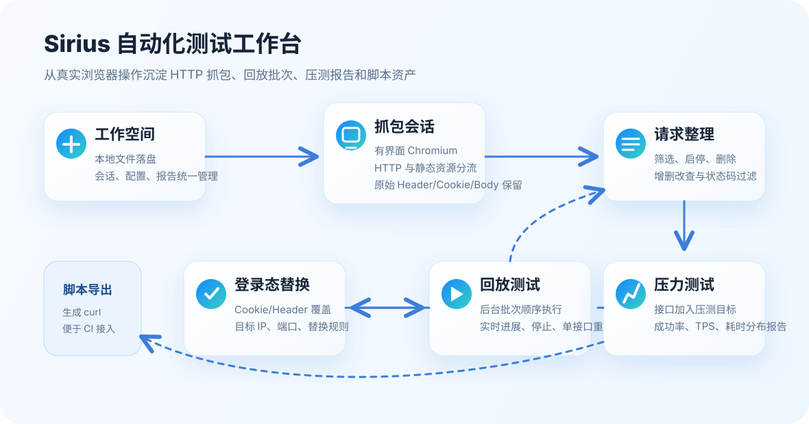
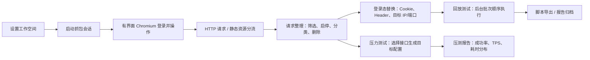
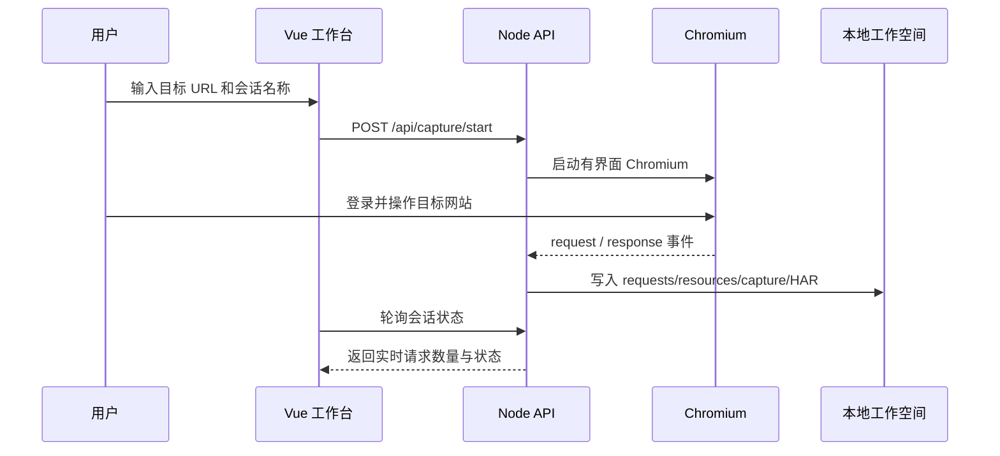
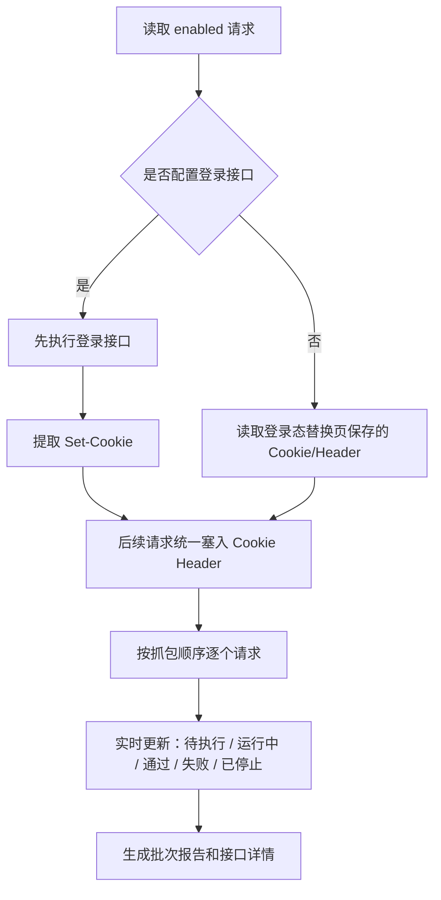
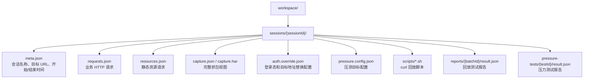

# Sirius 自动化测试工作台

<p align="center">
  
</p>

<p align="center">
  <strong>用真实浏览器操作沉淀 HTTP 抓包、接口回放、登录态接续、压力测试和脚本资产。</strong>
</p>

<p align="center">
  
  
  
  
</p>

## 项目简介

Sirius 自动化测试工作台是一个本地化 HTTP 抓包与自动化测试工具。它通过有界面 Chromium 记录真实登录和业务操作产生的网络请求，随后把请求整理成可回放、可替换登录态、可做压力测试、可导出脚本的测试资产。

项目不依赖数据库，所有抓包会话、请求清单、登录态配置、回放批次和压测报告都保存在本地工作空间目录中，方便查看、备份和迁移。

> 说明：为了保证脚本和回放准确性，抓包阶段会原样保留 Cookie、Session、Header 和 Body。请不要把 `workspace/` 目录提交到公共仓库；本项目已在 `.gitignore` 中默认忽略该目录。

## 功能总览



## 适用场景

- 从手工操作快速生成接口自动化测试素材。
- 对登录后的业务接口做 Cookie、Header、IP、端口和 Body 替换后回放。
- 抓包后禁用、删除或分类不需要回放的增删改接口。
- 对关键接口进行轻量压力测试，输出成功率、TPS、耗时分布和状态码分布。
- 生成 curl 脚本，交给 CI、巡检脚本或其他自动化平台复用。

## 核心能力

| 模块 | 说明 | 产物 |
| --- | --- | --- |
| 工作空间 | 设置本地文件目录，统一管理会话、配置、报告和脚本 | `workspace.config.json`、`workspace/` |
| 抓包会话 | 启动有界面 Chromium，用户手动登录和操作，服务端实时记录请求与响应 | `meta.json`、`requests.json`、`resources.json`、`capture.har` |
| 请求整理 | HTTP 请求与静态资源分开展示；支持搜索、方法筛选、状态码筛选、启停、删除、增删改查分类 | 更新后的 `requests.json` |
| 登录态替换 | 保存覆盖模式、登录接口、Cookie、Header、目标协议、IP/域名、端口和替换规则 | `auth.override.json` |
| 回放测试 | 后台按抓包顺序生成批次并逐个执行 enabled 请求；支持实时进度、停止、删除批次、单接口重测 | `reports/{batchId}/result.json` |
| 压力测试 | 从抓包会话选择接口加入压测目标，设置并发、时长、超时、权重并生成报告 | `pressure.config.json`、`pressure-tests/{testId}/result.json` |
| 脚本导出 | 根据原始请求或登录态替换配置生成 curl 回放脚本 | `scripts/*.sh` |

## 工作流图



## 抓包机制

点击“开始抓包”后，后端通过 Playwright 启动一个有界面 Chromium 窗口。用户在这个浏览器里完成登录、查询、提交等真实操作，服务端监听页面网络事件并写入当前会话目录。



抓包结果会拆成两类：

- `requests.json`：业务 HTTP 请求，后续可整理、回放、压测和导出脚本。
- `resources.json`：静态资源请求，例如 HTML、JS、CSS、图片、字体、媒体等，只用于查看，不参与回放。

## 回放与登录态接续

回放测试在后端后台执行，切换页面不会取消正在运行的批次。每次点击“运行回放”都会生成新的批次，并记录当时使用的登录态替换配置。



回放前会先探测目标 IP 和端口是否可达。如果目标不可达，当前批次会直接失败，避免等待每个接口逐个超时。

## 压力测试说明

压力测试页面会展示每个候选接口的原始地址和压测地址。压测地址来自抓包请求，并会叠加登录态替换页里的目标协议、IP/域名和端口配置。

典型使用步骤：

1. 选择抓包会话。
2. 在“接口选择”中点击“加入压测”，把接口加入压测目标配置。
3. 调整并发数、持续时间、最大请求数、超时时间、请求间隔和接口权重。
4. 点击“保存”，刷新页面后配置仍会保留。
5. 点击“运行压力测试”，查看实时指标和报告详情。

报告包含：

- 总请求数、成功数、失败数。
- 成功率、TPS。
- 平均耗时、P50、P90、P95、P99。
- 状态码分布和错误样本。
- 各接口维度的压测统计。

## 本地文件结构



实际目录示例：

```text
workspace/
  sessions/
    20260605-184759-site/
      meta.json
      requests.json
      resources.json
      capture.json
      capture.har
      auth.override.json
      pressure.config.json
      scripts/
      reports/
      pressure-tests/
```

## 快速启动

环境要求：

- Node.js `20.19+` 或 `22.12+`
- npm
- Playwright Chromium 浏览器依赖

```bash
cd /Users/zhaomk/workspace/mycode/github/sirius-testbench
npm install
npm run dev
```

启动后访问：

- 前端地址：`http://localhost:5175`
- 后端 API：`http://localhost:5174`

如果首次启动抓包时提示缺少 Chromium，可以执行：

```bash
npx playwright install chromium
```

## 常用命令

```bash
# 开发模式，同时启动前端和后端
npm run dev

# 只启动后端 API
npm run server

# 只启动前端 Vite
npm run client

# 构建前端静态资源
npm run build

# 生产模式启动后端并托管 dist
npm run start
```

## 页面导航

| 页面 | 主要操作 |
| --- | --- |
| 工作空间 | 设置工作空间目录，查看会话和报告统计 |
| 抓包会话 | 创建新会话，打开有界面 Chromium，停止抓包，删除会话 |
| 请求整理 | 区分 HTTP 请求和静态资源；筛选、启停、分类、删除接口 |
| 登录态替换 | 配置覆盖模式、登录接口、Cookie/Header、目标 IP/端口和替换规则 |
| 回放测试 | 创建回放批次，查看实时进展、批次详情、接口详情，支持停止和重测 |
| 压力测试 | 保存压测目标配置，运行压测，查看报告和接口维度统计 |
| 脚本导出 | 导出原始请求或带登录态替换的 curl 脚本 |

## 安全与提交建议

- `workspace/` 中包含真实 Cookie、Session 和业务请求体，默认不会提交。
- `node_modules/`、`dist/`、`workspace/` 已写入 `.gitignore`。
- 如果需要共享测试资产，建议先复制一份受控工作空间，再确认其中的认证信息是否适合共享。
- 推荐提交源码、文档和配置；不要提交本地抓包会话和报告产物。

## 验证命令

```bash
npm run build
node --check server/index.js
```

当前项目已在本机完成上述验证，Vite 构建可能提示 chunk 较大，这是前端依赖体积提醒，不影响运行。
